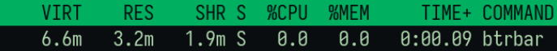
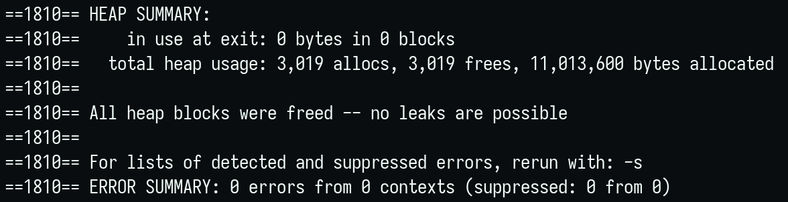
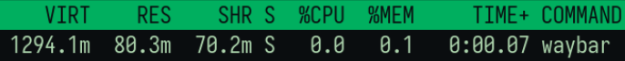
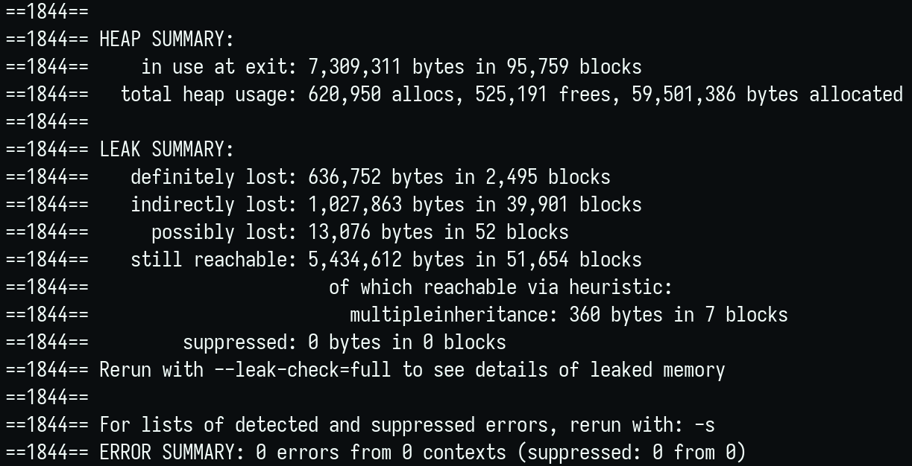

# btrbar
**A bar for dwl.**  


Lightweight, minimal-dependency bar written and configured in C.  

- No GTK, Qt, or Cairo/Pango just few single-header libraries for font and tray-icon bitmap parsing  
- Built-in system tray  
- Clickable blocks  
- Communicates with dwl’s IPC


## Building & Installing

### Dependencies

- **[dwl](https://codeberg.org/dwl/dwl)** (with [ipc](https://codeberg.org/dwl/dwl-patches/src/branch/main/patches/ipc) patch if you enable TAGS, LAYOUT, or TITLE blocks)  
- **wayland-protocols** & **pkg-config**  
- **wlroots**  
- **libdbus-1** (if TRAY support is enabled)  
- **[stb lib](https://github.com/nothings/stb)**: stb_truetype.h, stb_image.h, stb_image_resize2.h (already bundled in `include/`)

```bash
git clone https://github.com/julmajustus/btrbar.git
cd btrbar

# Build
make release

# Install to /usr/local/bin
sudo make install

# Uninstall
sudo make uninstall

# Full clean
make fclean
```

## Configuration

All settings and block definitions live in include/config.h.  


**Defining blocks**  

Modify the static const block_cfg_t blocks_cfg[] = { … }; array:

- Order: blocks are drawn left -> center -> right in array order

- Type: BLK_FUNC, BLK_SCRIPT, BLK_TEMP, BLK_VOL, BLK_TAG, BLK_LAYOUT, BLK_TITLE, BLK_TRAY

- Interval: in seconds (-1 = no timed updates)

```bash
{
  BLK_FUNC,         // block type
  "cmd",            // shell command (for SCRIPT; TEMP reads sensor path)
  "pre ",           // prefix text
  my_func,          // callback (for BLK_FUNC)
  PFX_COLOR,        // prefix color (0xAARRGGBB)
  FG_COLOR,         // text color
  BG_COLOR,         // background color
  on_click,         // click handler (block_t*, button)
  on_scroll,        // scroll handler (block_t*, delta)
  ALIGN_RIGHT,      // ALIGN_LEFT | ALIGN_CENTER | ALIGN_RIGHT
  5                 // update interval in seconds
},
```
## Customizing & Extending

**Add a new built-in functions or modify existing:**  

- Write your void foo(char *buf, size_t bufsz) in **src/user_blocks.c**.
- Add prototype in include/blocks.h.
- Reference it in include/config.h.

**Custom scripts:**  

- For simple one-line outputs, set type=BLK_SCRIPT and cmd="/path/to/your-script.sh".

**Click/scroll actions:**  

- Handlers take (block_t *blk, int button_or_amt).
- Use run_cmd(...), or call into your own C code.

## Styling 

- Tweak colors and toggles in config.h  
- Colors use ARGB: 0xAARRGGBB, `alpha, red, green, blue`  

<details>
<summary style="font-size: 1.2em;"><strong>Comparison</strong></summary>

Resource usage comparison: 1 minute runtime of similar bar setups.  

  
  


   
  
</details>
